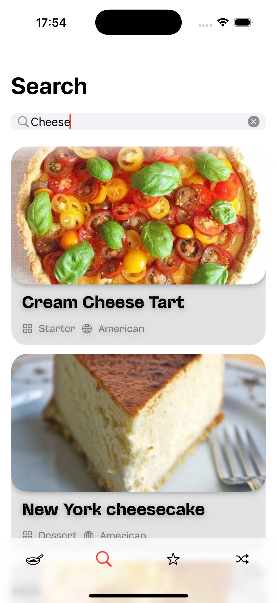
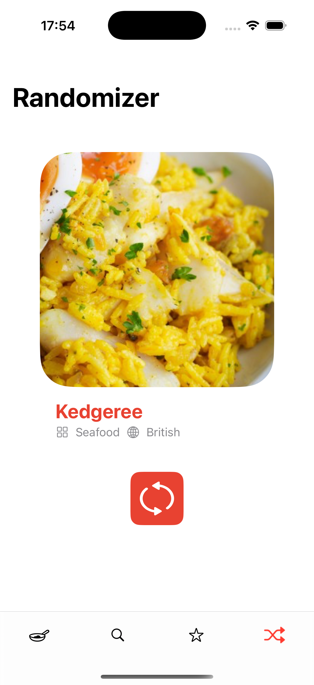

# EatHub
Sirius 2025 mobile project

## Features

- Search for recipes from all over the world 🌎
- Detailed description and instructions 📝
- Add recipes to Favourites ❤️
- Popular and recent dishes 🌟
- An idea for a random dish 🍽️

### Also:
- Light/dark mode 
- Stunning SwiftUI design
- Cached images
- Custom fonts 

## Getting started

### Prerequisites
* Xcode 15+
* Swift 5
* XcodeGen or Homebrew

## Installation
1. Clone the repo
   ```sh
   git clone https://github.com/CaptainSharky/eatHub.git
   ```
2. Find the project folder
   ```sh
   cd eatHub
   ```
3. Generate .xcodeproj file with Homebrew for the first time
   ```sh
   sh start.sh --full
   ```
   or use xcodegen further
   ```sh
   xcodegen
   ```

## Authors

- [@prokyhouse](https://github.com/prokyhouse)
- [@СaptainSharky](https://github.com/CaptainSharky)
- [@danast2](https://github.com/danast2)
- [@t-anastasiia](https://github.com/t-anastasiia)
- [@aldonin](https://github.com/aldonin)

## Screenshots



